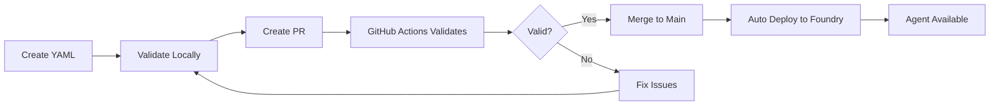

# Azure AI Foundry - Declarative Agents Repository

Deploy and manage AI agents declaratively using YAML definitions with automated GitHub Actions deployment to Azure AI Foundry.

## 🚀 Overview

This repository enables you to:
- Define AI agents using declarative YAML syntax
- Validate agent schemas automatically
- Deploy agents to Azure AI Foundry via GitHub Actions
- Manage multiple agents in a centralized repository

## 📁 Project Structure

```
.
├── agents/                      # Agent YAML definitions
│   └── mslearnagent.yaml       # Microsoft Learn documentation agent
├── scripts/                     # Automation scripts
│   ├── validate_yaml.py        # YAML schema validator
│   └── deploy_agent.py         # Deployment script
├── .github/
│   └── workflows/
│       └── deploy-agents.yml   # CI/CD pipeline
├── docs/
│   └── AGENT_YAML_SCHEMA.md   # Complete YAML schema documentation
├── main.py                     # Local development entry point
├── requirements.txt            # Python dependencies
├── .env                        # Environment variables (not committed)
└── README.md                   # This file
```

## 🛠️ Prerequisites

- Python 3.12
- .NET Runtime 8.x (for PowerFx support)
- Azure subscription with Azure AI Foundry project
- Azure CLI (for local development)

## 📦 Installation

### Local Development Setup

1. **Clone the repository**
   ```bash
   git clone <your-repo-url>
   cd MAFPruebas
   ```

2. **Install Python dependencies**
   ```bash
   pip install -r requirements.txt
   ```

3. **Install .NET Runtime** (for PowerFx)
   ```bash
   # On Ubuntu/Debian
   wget https://dot.net/v1/dotnet-install.sh -O dotnet-install.sh
   chmod +x dotnet-install.sh
   ./dotnet-install.sh --channel 8.0
   ```

4. **Configure environment variables**
   
   Create a `.env` file:
   ```bash
   AZURE_FOUNDRY_PROJECT_ENDPOINT=https://your-project.services.ai.azure.com
   AZURE_FOUNDRY_PROJECT_MODEL_ID=gpt-4.1
   APPLICATIONINSIGHTS_CONNECTION_STRING=InstrumentationKey=...
   OTEL_TRACES_EXPORTER=none
   OTEL_METRICS_EXPORTER=none
   OTEL_LOGS_EXPORTER=none
   ```

5. **Authenticate with Azure**
   ```bash
   az login
   ```

## 🎯 Usage

### Creating a New Agent

1. **Create YAML definition** in `agents/` directory:

   ```yaml
   # agents/my-new-agent.yaml
   kind: Prompt
   name: MyNewAgent
   description: Description of what this agent does
   instructions: System instructions for the agent
   
   model:
     id: =Env.AZURE_FOUNDRY_PROJECT_MODEL_ID
     connection:
       kind: remote
       endpoint: =Env.AZURE_FOUNDRY_PROJECT_ENDPOINT
   
   tools:
     - kind: web_search
       description: Search the web for information
   ```

2. **Validate locally**:
   ```bash
   python scripts/validate_yaml.py agents/my-new-agent.yaml
   ```

3. **Test locally** (optional):
   ```bash
   # Edit main.py to point to your agent
   python main.py
   ```

### Deploying Agents

#### Manual Deployment (Local)

```bash
# Deploy a specific agent
python scripts/deploy_agent.py agents/mslearnagent.yaml
```

#### Automated Deployment (GitHub Actions)

**On Pull Request:**
- ✅ Validates YAML schema
- ❌ Does NOT deploy

**On Push to Main:**
- ✅ Validates YAML schema
- ✅ Deploys all changed agents to Azure AI Foundry

**Manual Trigger:**
1. Go to Actions → "Deploy Agents to Azure AI Foundry"
2. Click "Run workflow"
3. Select agent file to deploy

## 🔐 GitHub Secrets Configuration

Configure these secrets in your GitHub repository settings:

| Secret Name | Description | Example |
|------------|-------------|---------|
| `AZURE_CREDENTIALS` | Service Principal JSON | `{"clientId": "...", "clientSecret": "...", ...}` |
| `AZURE_FOUNDRY_PROJECT_ENDPOINT` | Azure AI Foundry project endpoint | `https://yourproject.services.ai.azure.com` |
| `AZURE_FOUNDRY_PROJECT_MODEL_ID` | Default model deployment | `gpt-4.1` |
| `APPLICATIONINSIGHTS_CONNECTION_STRING` | Application Insights connection | `InstrumentationKey=...` |

### Creating Azure Service Principal

```bash
az ad sp create-for-rbac \
  --name "github-actions-agents" \
  --role contributor \
  --scopes /subscriptions/{subscription-id}/resourceGroups/{resource-group} \
  --sdk-auth
```

Copy the JSON output to `AZURE_CREDENTIALS` secret.

## 📝 Available Agents

### Microsoft Learn Agent
- **File**: `agents/mslearnagent.yaml`
- **Description**: Searches and retrieves information from Microsoft Learn documentation
- **Tools**: MCP (Model Context Protocol) for Microsoft Learn API
- **Use Cases**: Developer documentation queries, Azure guidance, code samples

## 🧪 Validation

The YAML validator checks:
- ✅ Required fields (`kind`, `name`)
- ✅ Valid `kind` values (`Prompt`, `Agent`)
- ✅ Model configuration (`id`, connection)
- ✅ Connection types and required fields
- ✅ Tool definitions and requirements
- ✅ PowerFx expression syntax
- ⚠️  Environment variable usage

### Running Validation

```bash
# Validate single agent
python scripts/validate_yaml.py agents/mslearnagent.yaml

# Validate all agents
for agent in agents/*.yaml; do
  python scripts/validate_yaml.py "$agent"
done
```

## 📚 Documentation

- **[AGENT_YAML_SCHEMA.md](docs/AGENT_YAML_SCHEMA.md)** - Complete YAML schema reference
  - All agent types and fields
  - Connection types (remote, key, reference, anonymous)
  - Tool types (function, web_search, file_search, MCP, etc.)
  - PowerFx expressions
  - Complete examples

## 🔄 Workflow



## 🐛 Troubleshooting

### Common Issues

**PowerFx evaluation fails:**
```bash
# Ensure Python <= 3.13 and .NET is installed
python --version  # Should be 3.12
dotnet --version  # Should be 8.x
```

**Deployment authentication fails:**
```bash
# Re-authenticate with Azure
az login
az account show  # Verify correct subscription
```

**Agent not found after deployment:**
- Check Application Insights logs
- Verify environment variables in GitHub secrets
- Ensure Service Principal has correct permissions

### Debug Mode

Enable debug logging:
```bash
export AZURE_LOG_LEVEL=DEBUG
python scripts/deploy_agent.py agents/mslearnagent.yaml
```

## 🤝 Contributing

1. Create a new branch for your agent
2. Add/modify YAML in `agents/` directory
3. Validate locally
4. Create Pull Request
5. Wait for automated validation
6. Merge to deploy

## 📄 License

Copyright (c) Microsoft. All rights reserved.

## 🔗 Resources

- [Microsoft Agent Framework](https://github.com/microsoft/agent-framework)
- [Azure AI Foundry Documentation](https://learn.microsoft.com/azure/ai-services/)
- [PowerFx Documentation](https://learn.microsoft.com/power-platform/power-fx/)
- [Model Context Protocol](https://modelcontextprotocol.io/)

## 📞 Support

For issues and questions:
1. Check [AGENT_YAML_SCHEMA.md](docs/AGENT_YAML_SCHEMA.md) for schema reference
2. Run validation scripts for detailed error messages
3. Check GitHub Actions logs for deployment issues
4. Review Application Insights for runtime errors
